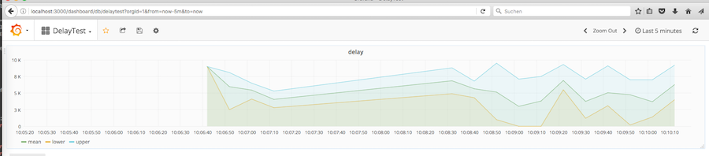

statsdaemon
==========

Port of Etsy's statsd (https://github.com/etsy/statsd), written in Go (originally based
on [amir/gographite](https://github.com/amir/gographite)).

Supports

* Timing (with optional percentiles)
* Counters (positive and negative with optional sampling)
* Gauges (including relative operations)
* Sets

Note: Only integers are supported for metric values.

[](http://travis-ci.org/bitly/statsdaemon)

Installing
==========

### Binary Releases
Pre-built binaries for darwin and linux.

### Current Stable Release: `v0.7.1`
* [statsdaemon-0.7.1.darwin-amd64.go1.4.2.tar.gz](https://github.com/bitly/statsdaemon/releases/download/v0.7.1/statsdaemon-0.7.1.darwin-amd64.go1.4.2.tar.gz)
* [statsdaemon-0.7.1.linux-amd64.go1.4.2.tar.gz](https://github.com/bitly/statsdaemon/releases/download/v0.7.1/statsdaemon-0.7.1.linux-amd64.go1.4.2.tar.gz)

### Older Releases
* [statsdaemon-0.6-alpha.darwin-amd64.go1.3.tar.gz](https://github.com/bitly/statsdaemon/releases/download/v0.6-alpha/statsdaemon-0.6-alpha.darwin-amd64.go1.3.tar.gz)
* [statsdaemon-0.6-alpha.linux-amd64.go1.3.tar.gz](https://github.com/bitly/statsdaemon/releases/download/v0.6-alpha/statsdaemon-0.6-alpha.linux-amd64.go1.3.tar.gz)
* [statsdaemon-0.5.2-alpha.linux-amd64.go1.1.1.tar.gz](https://github.com/bitly/statsdaemon/releases/download/v0.5.2-alpha/statsdaemon-0.5.2-alpha.linux-amd64.go1.1.1.tar.gz)

### Building from Source
```
git clone https://github.com/bitly/statsdaemon
cd statsdaemon
go get github.com/bmizerany/assert #for tests
go build
```


Command Line Options
====================

```
Usage of ./statsdaemon:
  -address=":8125": UDP service address
  -debug=false: print statistics sent to graphite
  -delete-gauges=true: don't send values to graphite for inactive gauges, as opposed to sending the previous value
  -flush-interval=10: Flush interval (seconds)
  -graphite="127.0.0.1:2003": Graphite service address (or - to disable)
  -max-udp-packet-size=1472: Maximum UDP packet size
  -percent-threshold=[]: percentile calculation for timers (0-100, may be given multiple times)
  -persist-count-keys=60: number of flush-intervals to persist count keys
  -postfix="": Postfix for all stats
  -prefix="": Prefix for all stats
  -receive-counter="": Metric name for total metrics received per interval
  -tcpaddr="": TCP service address, if set
  -version=false: print version string
```

Docker Compose Playground
=========================

To try out the daemon, one can start a backend and frontend as Docker Services. For it to work a Docker SWARM is needed.

```
$ docker swarm init
```

After the initialisation, just start the services using the docker-cli.

```
$ docker stack deploy -c docker-compose.yml $(basename ${PWD})
Creating service statsdaemon_frontend
Creating service statsdaemon_influxdb
```
After a couple of seconds grafana4 is available under [localhost:3000](http://localhost:3000).

Now start the statsdaemon...

```
$ go build
$ ./statsdaemon -address 0.0.0.0:8125
2017/05/16 10:06:12 listening on 0.0.0.0:8125
```

...and begin to push metrics...

```
$ docker run -ti --rm --net=host -e HOST=192.168.1.11 qnib/plain-qframe-client delay.sh 10
> execute CMD 'delay.sh 10'
Send: delay:9000|ms to 192.168.1.11 && sleep 0.9000
Send: delay:7300|ms to 192.168.1.11 && sleep 0.7300
Send: delay:8100|ms to 192.168.1.11 && sleep 0.8100
Send: delay:2500|ms to 192.168.1.11 && sleep 0.2500
Send: delay:4100|ms to 192.168.1.11 && sleep 0.4100
Send: delay:6000|ms to 192.168.1.11 && sleep 0.6000
Send: delay:5200|ms to 192.168.1.11 && sleep 0.5200
Send: delay:6500|ms to 192.168.1.11 && sleep 0.6500
Send: delay:2800|ms to 192.168.1.11 && sleep 0.2800
Send: delay:5300|ms to 192.168.1.11 && sleep 0.5300
```

... the daemon will forward it.

```
2017/05/16 10:06:42 sent 1 stats to 127.0.0.1:2003
2017/05/16 10:06:52 sent 1 stats to 127.0.0.1:2003
2017/05/16 10:07:02 sent 1 stats to 127.0.0.1:2003
2017/05/16 10:07:12 sent 1 stats to 127.0.0.1:2003
```


